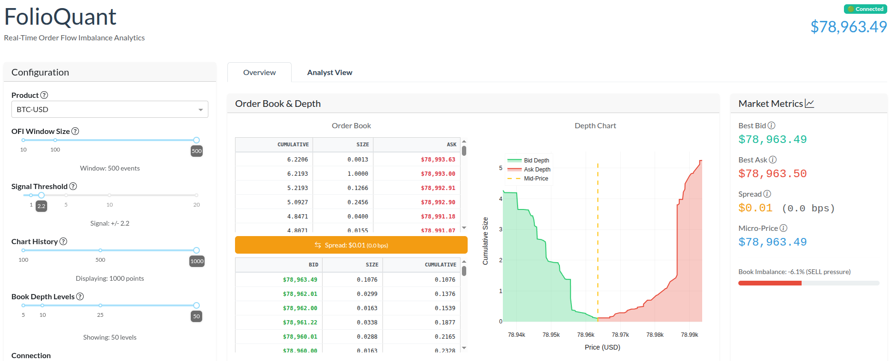

# FolioQuant: Real-Time OFI Analytics

**FolioQuant** is a personal project developed to explore high-frequency quantitative analysis using Python. It implements a real-time **Order Flow Imbalance (OFI)** trading strategy, visualizing market microstructure signals through a reactive real-time dashboard.

The primary goals of this project were to:
1.  Utilise **WebSockets** for real-time market data ingestion.
2.  Learn **Dash (Plotly)** for building interactive, low-latency financial dashboards.
3.  Explore **Pandas** and **NumPy** for time-series signal processing.




## Overview

The application computes several key performance indicators in real-time within the `MetricsService` class. These metrics help evaluate the predictive power and risk-adjusted returns of the OFI signal.

### 1. Sharpe Ratio (Risk-Adjusted Return)
*   **Definition**: Measures the performance of the OFI strategy adjusted for its risk (volatility).

    $$S = \frac{E[R_p] - R_f}{\sigma_p}$$
* Calculated using rolling 1-second return buckets to ensure statistical significance.
* **Annualized**: Multiplied by $\sqrt{\text{seconds per year}}$.
* Includes transaction costs (spread + simulated fee).

### 2. Hit Rate (Directional Accuracy)
*   **Definition**: The percentage of times the OFI signal correctly predicts the direction of the *next* price move.
    $$\text{Hit Rate} = \left( \frac{\text{Correct Predictions}}{\text{Total Predictions}} \right) \times 100$$
* a "Correct" prediction matches the sign of OFI(t) with price_change(t+1).

### 3. Maximum Drawdown
*   **Definition**: The largest peak-to-trough decline in the strategy's cumulative returns.
*   **Implementation**:
* Tracks the running peak of cumulative returns.
* Updates whenever the current return falls below the peak.

### 4. Win/Loss Ratio
*   **Definition**: The ratio of the average profit from winning trades to the average loss from losing trades.
    $$\text{W/L Ratio} = \frac{\text{Avg(Winning Magnitudes)}}{\text{Avg(Losing Magnitudes)}}$$
* Helps assess whether the strategy wins big and loses small, or vice versa.

### 5. Signal Persistence
*   **Definition**: The average number of consecutive periods the signal remains in the same direction (positive or negative).
* Calculates the mean length of run sequences. Higher persistence may indicate stronger trending periods.

### 6. Information Coefficient (IC)
*   **Definition**: The correlation between the signal at time $t$ and future price returns at time $t+lag$.
* Uses Pearson correlation on rolling windows.
* **Alpha Decay**: The IC is also calculated at various lags (1s, 2s, ... 10s) to see how quickly the signal's predictive power fades.


## Quick Start

### Prerequisites
- Python 3.10+
- `pip`

### Installation
1.  Clone the repository:
    ```bash
    git clone [url]
    cd [dir]
    ```

2.  Run the installation script:
    ```bash
    ./run.sh install
    ```

3.  Run the application:
    ```bash
    ./run.sh
    ```

4. [Optional] Run tests:
    ```bash
    ./run.sh test
    ```

## Code Overview

FolioQuant follows a **N-Tier Architecture** aimed at decoupling data ingestion from visualization.

### 1. Infrastructure Layer (Input)
- **CoinbaseWebSocketClient**: Manages the persistent connection to Coinbase's WebSocket feed. It handles heartbeats, subscriptions, and automatic reconnections.
- **AsyncMessageQueue**: A bounded, async-aware queue that acts as a buffer between the fast WebSocket feed and the processing logic.

### 2. Service Layer (Processing)
- **BookManager**: Reconstructs the Level 2 Order Book locally. It handles snapshot initialization and applies incremental updates (`l2update`), ensuring sequence integrity.
- **OFICalculator**: The core signal engine. It observes Order Book state changes (Observer Pattern) and calculates the **Order Flow Imbalance** metric:
    $OFI = \sum(e_n)$ where $e_n$ is the signed contribution of bid/ask size and price changes.
- **MetricsService**: Computes complex analytical metrics (Sharpe Ratio, Hit Rate) on the streaming signal data.

### 3. Application Layer (Presentation)
- **DashApp**: A Plotly Dash application running on Flask.
- **State Management**: Uses a thread-safe global `DashboardState` object. The async processing loop runs in a background thread, updating this state, while the Dash frontend polls the state via lightweight callbacks (`10Hz` for fast metrics, `2Hz` for charts).
- **Custom WebSocket Server**: The app runs a secondary local WebSocket server to broadcast processed metrics to the frontend, enabling push-based updates (an alternative to polling).


## Assumptions

Relying on the following assumptions:

1.  **Execution Simulation**: The "Strategy Performance" (Sharpe, PnL) is **theoretical**. It assumes we could execute immediately at the generic price when the signal crosses a threshold, adjusted for a simulated **Spread Cost** and **Trading Fee**.
2.  **Latency**: The "Latency" metric measures network+processing time (Trade -> Ingest -> Dashboard) based on exchange matching engine timestamps, without NTP time synchronization applied.
3.  **Inventory**: The "Inventory Risk" metric in the Analyst View is currently **simulated** (mock data) to demonstrate how a production system would display position limits.
